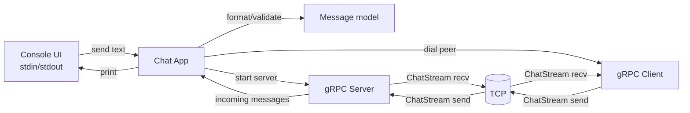
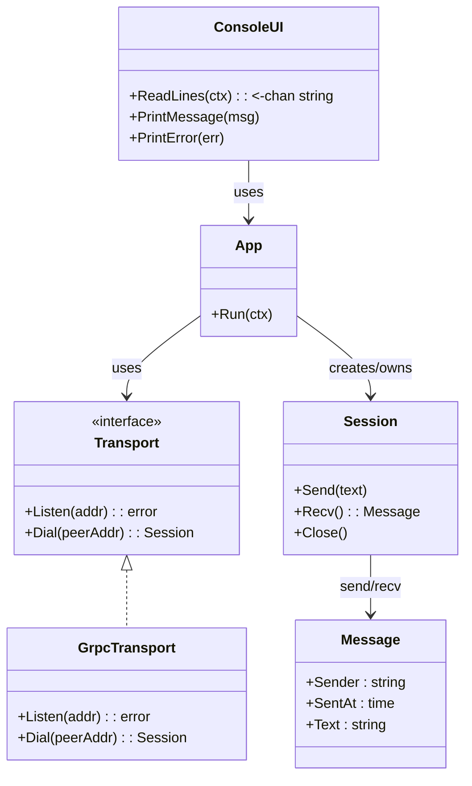
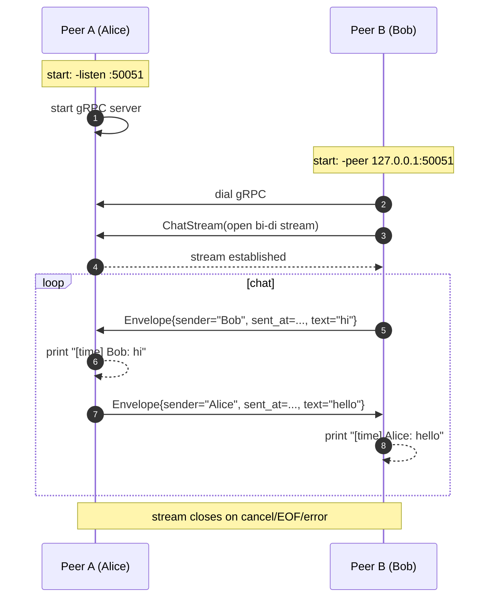

# P2P gRPC чат (Go) — документ по заданию

## 1. Цель
Спроектировать и реализовать консольный peer-to-peer чат (1↔1) на Go с прямым соединением между двумя узлами через gRPC.

## 2. Формализованные требования

### 2.1 Функциональные (FR)
- **FR-1**: Приложение должно обеспечивать прямое соединение peer↔peer (без центрального сервера).
- **FR-2**: Пользовательский интерфейс — консольный.
- **FR-3**: Каждое полученное сообщение должно отображаться в виде: имя отправителя + дата/время отправки + текст.
- **FR-4**: При запуске можно указать `-peer <host:port>` для подключения к другому peer-у.
- **FR-5**: Если `-peer` не указан, приложение работает в режиме ожидания входящего подключения (слушает порт).
- **FR-6**: При запуске обязательно указывается `-name <username>`.

### 2.2 Нефункциональные (NFR)
- **NFR-1**: Код должен быть читаемым и поддерживаемым (чистые границы модулей, отсутствие лишней сложности).
- **NFR-2**: Должны быть автоматические тесты.
- **NFR-3**: Архитектурное решение не должно содержать избыточных компонентов.

### 2.3 Ограничения и допущения
- Сценарий 1↔1: одно активное соединение между двумя процессами.
- Адрес peer-а задаётся вручную.
- Не реализуется NAT traversal/relay; предполагается, что входящий порт доступен.

## 3. Обоснование выбора технологий
- **Go**: простой кроссплатформенный деплой, удобная конкурентность (goroutines), стандартная библиотека для сетевых примитивов.
- **gRPC**:
  - формальный контракт (`.proto`): проще проверять совместимость и писать интеграционные тесты;
  - **bidirectional streaming** естественен для чата;
  - типизация и расширяемость протокола без ломки формата.

## 3.1 Декомпозиция задач

Плановое распределение задач между участниками команды вынесено в отдельный документ:

- [docs/task-decomposition.md](task-decomposition.md)

## 4. Обзор решения
Каждый экземпляр приложения может:
- слушать входящие подключения (gRPC server),
- подключаться к другому peer (gRPC client).

Коммуникация: один gRPC метод с двунаправленным потоком. В рамках одного соединения обе стороны могут одновременно отправлять и принимать сообщения.

### 4.1 Сценарии запуска (целевые)
- Ожидание входящего: `chat -listen :50051 -name Alice`
- Подключение к peer: `chat -peer 127.0.0.1:50051 -name Bob`

Примечание по режиму `-peer`: для варианта 1↔1 допускается, что при наличии `-peer` мы поднимаем только исходящее подключение. При необходимости можно включить `-listen` и для подключающейся стороны, но это не требуется для базового сценария.

## 5. Диаграмма компонентов

### Описание компонентов
- **Console UI**: читает строки из stdin, отображает входящие сообщения и ошибки.
- **Chat App**: связывает UI и транспорт, управляет жизненным циклом (context cancel/shutdown).
- **Message model**: структура сообщения и правила валидации/форматирования.
- **gRPC Server**: принимает входящее соединение и обслуживает stream.
- **gRPC Client**: устанавливает исходящее соединение и открывает stream.

## 6. Диаграмма классов (логическая модель)
Диаграмма отражает ключевые сущности и их ответственности.

### Описание основных сущностей
- **App**: точка координации; поднимает server/dial, запускает горутины stdin→send и recv→stdout, завершает всё по cancel/ошибке.
- **ConsoleUI**: изолирует ввод/вывод (для тестов можно подменять).
- **Transport/GrpcTransport**: инкапсулирует детали gRPC.
- **Session**: абстракция над одним активным стримом.
- **Message**: доменная структура сообщения.

### Модули (логическая структура)
- `cmd/chat` — точка входа, парсинг флагов, запуск приложения.
- `internal/app` — оркестрация: старт сервера/клиента, жизненный цикл, контекст отмены.
- `internal/transport/grpcchat` — gRPC реализация: server handler, dialer, stream read/write.
- `internal/ui/console` — чтение stdin, печать сообщений в stdout.
- `internal/protocol` — proto-объекты (генерация), адаптеры и валидация.

## 7. gRPC контракт
- Сервис: `ChatService`
- RPC: `ChatStream(stream Envelope) returns (stream Envelope)`
- Сообщение: `Envelope { sender, sent_at, text }`

Почему stream:
- чат — это непрерывный двусторонний обмен;
- один stream = одна “сессия” между двумя peer.

## 8. Модель конкурентности
В каждом процессе минимум 3 параллельных потока выполнения:
- goroutine A: чтение stdin → отправка в gRPC stream.
- goroutine B: чтение из gRPC stream → печать в stdout.
- goroutine C (если слушаем): gRPC server `Serve`.

Завершение:
- общий `context.Context` (cancel) для остановки;
- при EOF stdin или ошибке stream — инициируется graceful shutdown.

## 9. Диаграмма последовательности

## 10. Обработка ошибок и устойчивость
- Ошибки сети/stream считаются фатальными для текущей сессии: печатаем причину, корректно завершаем.
- Для `-peer` можно добавить ограниченные ретраи подключения (например, 3 попытки с backoff), но без усложнения.

## 11. Логирование
- В stdout идут только сообщения чата и критические ошибки.
- Опционально: debug-логи в stderr (под флагом `-v`), чтобы не мешать UX.

## 12. Тестирование
Минимальный набор:
- Unit-тесты: форматирование сообщения для вывода; валидация (пустые строки не отправлять).
- Интеграционные тесты gRPC без реальной сети: `bufconn` (in-memory listener) для проверки stream send/recv.
